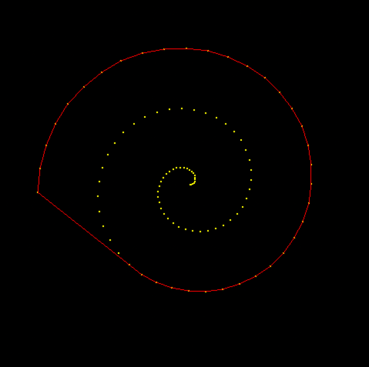
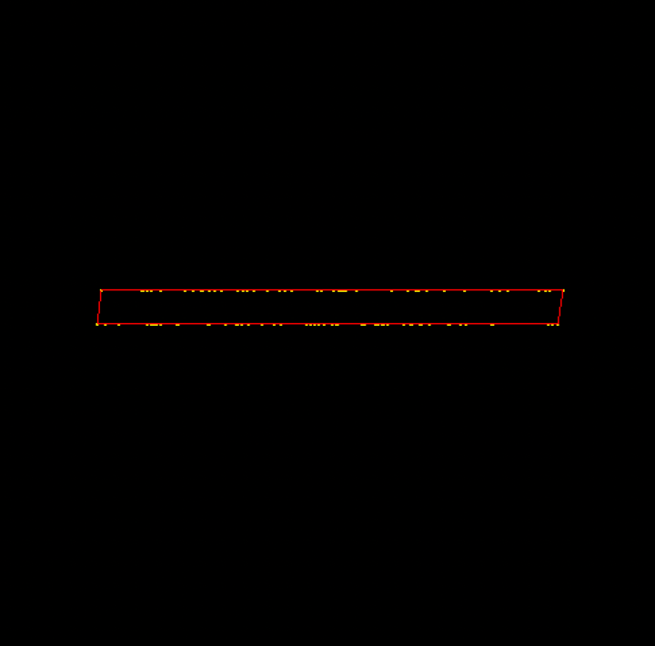
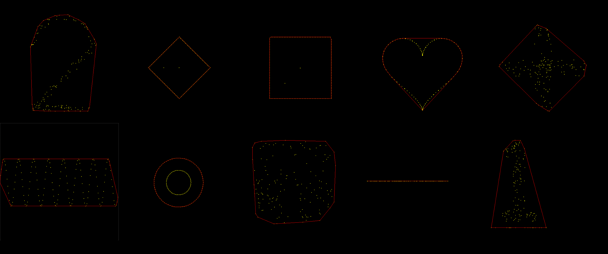

# Project 2 — Hull2D
#### David Gelinas
#### Professor Toma
#### Computational Geometry

*This project computes the convex hull of a set of points using a Graham Scan algorithm done in geom.cpp. In viewhull.cpp, there
are more test cases (initializers) that include collinear lines, spirals, hearts, and other fun shapes to test the algorithm.*

#### Degenerate Inputs:
> Degenerate inputs in this project mostly involved an inadequate amount of points (n ≤ 1) or sets with collinear points.
> Collinear points require a separate case than a simple leftOf or rightOf. To get around this, we use !leftOfStrictly so
> the algorithm still considers collinear points. Collinear points also neccesitate change in the sorting algorithm. Generally,
> the sorting algorithm can calculate the angular distance from p0 to all points, but it must instead compute the distance for
> collinear points (as all collinear points have the same angle regardless of distance). Another degenerate input is if the
> lowest point has a duplicate. The way I remedied this is after sorting the list, I iterate through the points list and delete
> duplicates. I stop the loop once I come across a point that is not a duplicate so as not to iterate through the entire list
> again (inefficient).

#### My Initalizers:
> I made two different initializers. One creates a spiral. The other creates two horizontal lines (perfect for testing many
> collinear points). The red lines represent the convex hull surrounding the points.

>  

Spiral Initializer Code

 
    
    void initialize_points_spiral(vector<point2d>& pts, int n) {
        printf("\ninitialize points spiral\n");
        pts.clear(); 

        double centerX = WINDOWSIZE / 2; // center of circle
        double centerY = WINDOWSIZE / 2; // center of circle
        
        double theta_increment = 1 / M_PI; // angle increment for the spiral
        double max_radius = WINDOWSIZE / 2.5; // maximum radius to keep the spiral within bounds
        double radius_increment = max_radius / (n / 10.0); // increment based on number of points
    
        for (int i = 0; i < n; i++) {
            double theta = i * theta_increment * 0.5; // angle increases as i increases
            double radius = radius_increment * i * 0.1; // scale the radius to keep it spiral-like
            radius = fmin(radius, max_radius);  // ensures the radius doesn't exceed the boundary
    
            point2d p;
            p.x = centerX + radius * cos(theta); 
            p.y = centerY + radius * sin(theta); 
            
            pts.push_back(p); 
        }
    }

Two Horizontal Lines Initializer Code

 
    
    void initialize_points_two_horizontal_lines(vector<point2d>& pts, int n) {
      printf("\ninitialize points two horizontal lines\n"); 
      //clear the vector just to be safe 
      pts.clear();   
      point2d p; 
      for (int i=0; i<n; i++) {
        p.x = (int)(.3*WINDOWSIZE)/2 + random() % ((int)(.7*WINDOWSIZE)); 
        p.y =  (int)WINDOWSIZE/2 + ((random() % 2 * 25)); 
        pts.push_back(p); 
      }
    }

#### Pictures of Other Initializers:
> 

#### Cool Extra Features:
> I implemented a keypress for 'j', which allows the user to switch through cases backwards. Because I have so many test cases,
> it makes it much easier to go back instead of pressing 'i' 10-15 times to loop back through.

#### Time spent:
> ##### Thinking:
> > I feel as though I had a good grasp of how the algorithm works before I started the lab. However, when debugging, I found
> > myself constantly drawing examples to help me understand where my code was going wrong. I would say I actually spent more
> > time thinking than coding, at least twice as much.
> ##### Coding/Documenting:
> > I didn't spend too much time coding, given that the end product of geom.cpp is less than 150 lines. Documenting took even less
> > time
> ##### Testing:
> > Testing was very helpful to see for what examples weren't working. I spent a lot of time writing print statements to see what
> > my sorted list looked like, what was going on in the comparator (there were a lot of errors there to begin with), what the
> > smallest point was, etc.
> ##### Total Time:
> > I probably spent around 10-13 hours on this lab in total. Most of it was spent on debugging and testing.

#### Reflection:
> This lab was a lot of fun and I feel as though I got a lot out of it. It was at times paninful to debug, but it really made
> me think of the root of problem and meticulously go through the logic step-by-step. I understand this problem very well now,
> and am certainly improving my coding skills. The only thing I would do differently is ask for help. I received little to no
> outside help for this project and for that reason learned a lot, but it could have been a faster, smoother process if I asked
> for help. 

